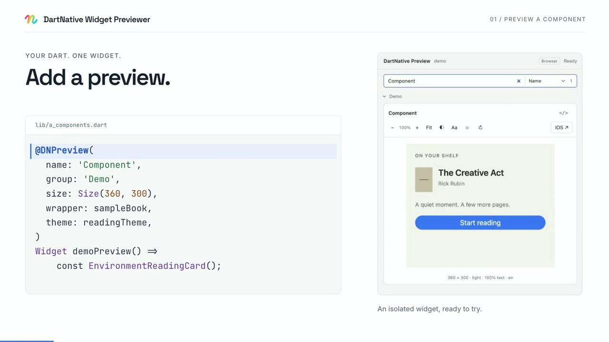

# DartNative Widget Previewer

Preview individual DartNative widgets in your browser or beside their source in VS Code. Save a Dart file to update its previews, try different sizes and themes, or inspect a widget and jump to its source.

Browser previews use an interpreter. Choose **Run on iOS** to check the same widget with the DartNative engine on a local simulator.

[](docs/media/demo.mp4)

[Watch the 34-second demo](docs/media/demo.mp4) · [Captions](docs/media/demo.en.vtt)

## Requirements

- Node.js 22 or later and npm.
- An installed DartNative SDK.
- For iOS previews: an Apple Silicon Mac, Xcode, an iOS simulator, and the DartNative entitlement required by your project.

## Quick start

Clone the repository and start the demo:

```sh
git clone https://github.com/tayormi/dartnative-widget-previewer.git
cd dartnative-widget-previewer
npm ci
npm run setup
npm run demo -- ./demo
npm start -- --project ./demo
```

Open the URL printed in your terminal. The [Shelf demo](docs/DEMO.md) includes 19 previews with interactive components, different text sizes, Arabic layout, and loading and error states. The demo command needs a new directory.

If `dn` is not on your PATH, supply its location during setup:

```sh
npm run setup -- --dn /absolute/path/to/your-sdk/bin/dn
```

For setup problems, run `npm run doctor`. For a release ZIP, see [packaged installation](docs/PACKAGING.md).

## Add a preview

Add the annotation package to your app, then annotate a widget factory:

```dart
import 'package:dartnative/dartnative.dart';
import 'package:dartnative_preview/dartnative_preview.dart';

@DNPreview(name: 'Greeting', group: 'Components', width: 320, height: 120)
Widget greetingPreview() => const Text('Hello, DartNative');
```

The [preview guide](docs/PREVIEWS.md) covers project setup, annotation options, mock data, and preview controls.

## VS Code

Run `npm run package:extension`, then install `dist/dartnative-widget-previewer-0.1.0.vsix` using **Extensions: Install from VSIX…**.

Open the generated demo folder and run **DartNative: Open Widget Previewer**. For your own app, follow the [extension setup guide](vscode/README.md).

## Current limits

The browser supports a subset of DartNative widgets and APIs. Native preview supports one local iOS simulator; Android and remote runners are not available. Some native environment overrides and fixture switches have [known limitations](docs/NATIVE-SDK-GAPS.md).

[MIT license](LICENSE) · [Contributing](CONTRIBUTING.md) · [Dependency notices](THIRD_PARTY_NOTICES.md)
